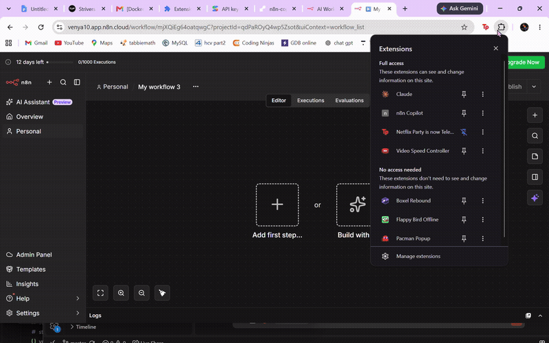

# n8n Copilot

[](https://github.com/venya10/n8n/actions/workflows/ci.yml)

A Chrome extension that suggests the next node while you build an n8n workflow, ranked using real usage data instead of guesswork.


*(placeholder — demo GIF/screenshot to be added)*

## Why this exists

Building an n8n workflow means repeatedly searching hundreds of node types by name to figure out what comes next. This project tests whether that next step can instead be predicted — from what real workflows actually do, not from a guess — and surfaced directly in the editor.

## Key results

- **494 real n8n workflow templates** scraped and mined for genuine usage patterns — no synthetic or hand-typed data.
- Evaluated on **1,547 held-out real edges**: **54.7% Recall@5**, **70.1% Recall@10** (does the real next node appear in the top 5 / top 10 suggestions?).
- Ships as **90% transition statistics + 10% semantic search** — a ratio measured through evaluation, not assumed.
- An optional LLM step improves ranking quality, but only modestly end-to-end — it's off by default.
- Fully deployed: live backend on Render, working Chrome extension, CI on every push.

## How it works

1. The extension reads your current n8n workflow as you edit it.
2. It sends the current node to a backend API, which ranks likely next nodes by combining:
   - **Statistics** — what commonly follows this node type in real workflows.
   - **Semantic search** — which node descriptions are conceptually related to what's needed next.
   - **(Optional) an LLM step** — describes the ideal next node before searching, sharpening the semantic match.
3. Ranked suggestions appear in a draggable floating panel, each labeled with why it was suggested (stats / semantic / both).

## Architecture

```
extension (Chrome, MV3)          backend (FastAPI)
┌─────────────────────┐          ┌───────────────────────────┐
│ reader.js             │  poll   │ POST /suggest               │
│  reads workflow via   │────────>│  transition stats           │
│  n8n's REST API       │         │  + semantic search           │
│                        │<────────│  (+ optional LLM/HyDE step)  │
│ overlay.js             │ suggest │ POST /feedback               │
│  shows ranked panel   │────────>│  nudges transition weights   │
└─────────────────────┘         └───────────────────────────┘
```

- `backend/` — FastAPI service, `POST /suggest` and `POST /feedback`.
- `extension/` — Manifest V3 Chrome extension (vanilla JS, no framework).
- `data_pipeline/` — scripts that mined the real dataset from n8n.io's template gallery.

## Key engineering decisions

- **Real mined data over hand-curated samples.** Scraping 494 real templates (instead of a small hand-typed set) surfaced two real bugs in the scraper itself — broken pagination and a wrong assumption about the API's response shape — the kind of issue that only appears once you point code at a real external system.
- **The 90/10 weight was measured, not guessed.** A held-out evaluation showed pure statistics beats every blend, with accuracy falling as semantic weight increases. Full sweep in [`docs/evaluation.md`](docs/evaluation.md).
- **The LLM step is validated, not oversold.** It measurably sharpens semantic search in isolation, but only adds a few points of accuracy once blended with statistics — a real improvement, not a dramatic one. Off by default given that modest gain against a slower, rate-limited external call.
- **Repeated node types are intentionally allowed.** An early version filtered out any node type already used elsewhere in the workflow. Real data showed this was wrong — chaining the same node type (e.g. two HTTP Request calls) is the single most common real pattern in the dataset — so the filter was removed.
- **Deployed as a small always-on container, not serverless.** The backend keeps an embedding model loaded in memory across requests; that doesn't fit the short-lived, stateless model most serverless platforms are built around.

## Tech stack

| | |
|---|---|
| Backend | FastAPI, `sentence-transformers` (MiniLM-L6-v2), NumPy, Docker |
| Extension | Chrome Manifest V3, vanilla JS, ESLint |
| Data pipeline | Python, n8n.io's public template API |
| Testing / CI | pytest, ruff, GitHub Actions |
| Deployment | Render (Docker) |
| Optional LLM | Gemini / Anthropic / Ollama |

## Evaluation summary

Full methodology, all experiments, and every number: [`docs/evaluation.md`](docs/evaluation.md). The headline table:

| `semantic_weight` | MRR | Recall@5 | Recall@10 |
|---|---|---|---|
| 0.0 (pure stats) | 0.347 | 54.7% | 70.1% |
| **0.1 (shipped)** | 0.345 | 53.9% | 69.2% |
| 1.0 (pure semantic) | 0.007 | 0.2% | 1.3% |

Two things worth knowing without reading the full doc:
- A real LLM-generated query makes semantic search itself dramatically better (isolated), but only a few points better once blended with statistics — statistics already does most of the work regardless of query quality.
- Giving the LLM the whole workflow as context (not just the last node) showed **no measurable improvement at n=30** — the sample was too small to detect an effect that size, if one exists. Shipped anyway since it's free at inference time.

## Run locally

```bash
docker compose up --build
curl http://localhost:8000/health
```

Tests: `cd backend && pip install -r requirements-dev.txt && ruff check . && pytest -q` (also `cd extension && npm ci && npm run lint`).

Extension: `chrome://extensions` → Developer Mode → Load unpacked → select `extension/`. Needs a real n8n instance to test against (n8n cloud, or `docker run -p 5678:5678 n8nio/n8n`).

## Deployment

Backend runs on [Render](https://render.com)'s free tier as a Docker service, deployed from [`render.yaml`](render.yaml): **[n8n-copilot-api.onrender.com](https://n8n-copilot-api.onrender.com)** (interactive API docs at `/docs`). Free tier spins down after 15 minutes idle, so a cold request can take 30-50s (no keep-alive pinger currently configured).

## Known limitations

- The extension reads workflow state via n8n's internal REST API (not a stable public contract) — verified against n8n cloud and a local Docker instance, not a production self-hosted deployment.
- 135 of 192 node types have real, written descriptions; the rest use a placeholder (shown not to affect ranking accuracy).
- `/feedback` only nudges in-memory counts — forgotten on restart, not persisted.
- No keep-alive pinger on the live deployment, so a cold start is a real (minor) first-request risk.

## Future improvements

- Persist `/feedback` to a real datastore instead of in-memory counts.
- Verify the workflow-reading endpoint against a production self-hosted n8n instance.
- Re-run the LLM-context experiment at a larger sample size (needs a paid API tier to avoid free-tier rate limits).
- Publish the extension to the Chrome Web Store.
- Add a keep-alive pinger (or move to an always-on tier) to remove the cold-start delay.
